# Brisic

## Deskripsi Aplikasi Web

Brisic (Brianaldo's Music) adalah suatu aplikasi berbasis web untuk mendengarkan musik. Pengguna dibedakan menjadi 3 kategori, yaitu
pengguna tidak terautentikasi(selanjutnya disebut <b>guest</b>), pengguna terautentikasi (selanjutnya disebut <b>user</b>), dan juga <b>admin</b>.

| Aktivitas             | Guest | User | Admin |
| :-------------------- | :---: | :--: | :---: |
| Melakukan Login       |  ✅   |  ✅  |  ✅   |
| Melakukan Register    |  ✅   |  ✅  |  ❌   |
| Mendengarkan Lagu     |  ⭕   |  ✅  |  ✅   |
| Melihat Detail Lagu   |  ✅   |  ✅  |  ✅   |
| Mengubah Detail Lagu  |  ❌   |  ❌  |  ✅   |
| Menambah lagu         |  ❌   |  ❌  |  ✅   |
| Menghapus lagu        |  ❌   |  ❌  |  ✅   |
| Melihat Detail Album  |  ✅   |  ✅  |  ✅   |
| Menambah Album        |  ❌   |  ❌  |  ✅   |
| Mengubah Detail Album |  ❌   |  ❌  |  ✅   |
| Menghapus Album       |  ❌   |  ❌  |  ✅   |
| Mencari Lagu          |  ✅   |  ✅  |  ✅   |
| Sortir lagu           |  ✅   |  ✅  |  ✅   |
| Filter Genre          |  ✅   |  ✅  |  ✅   |
| Melihat Daftar User   |  ❌   |  ❌  |  ✅   |

⭕ = Terbatas 3 Lagu perhari

## Daftar Requirement

- Docker
- Web Browser

## Cara Instalasi

1. Pull Repository ini
2. Aktifkan Docker Server
3. Masuk ke directory tugas ini
   ```bash
   cd tugas-besar-1
   ```
4. Setup environment variables dengan cara mengisi .env.example dan hapus .example pada nama file
5. Ketikkan
   ```bash
   docker-compose up --build
   ```

## Cara Menjalankan Server

1. Ketikkan
   ```bash
   docker-compose up
   ```
2. Buka Browser di http://localhost:8008/

## Screenshot

1. Halaman Login
   

2. Halaman Register
   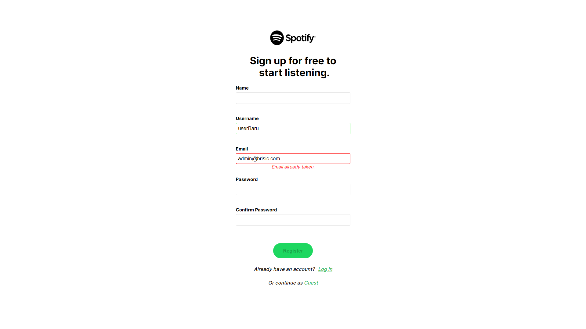

3. Halaman Home
   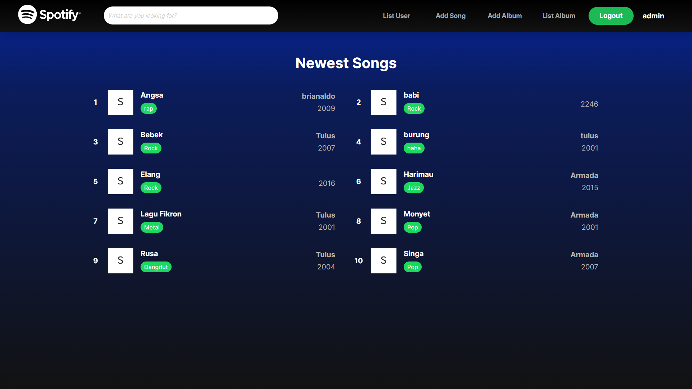

4. Halaman Daftar Album
   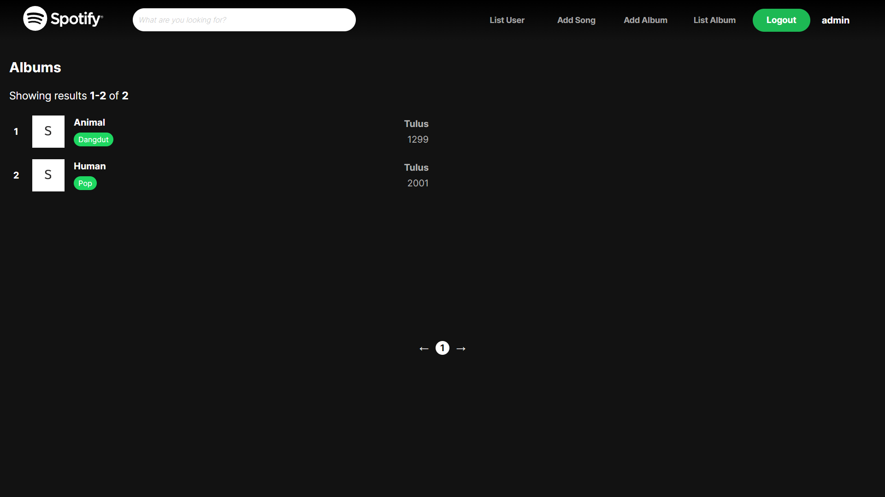

5. Halaman Search, Sort, Filter
   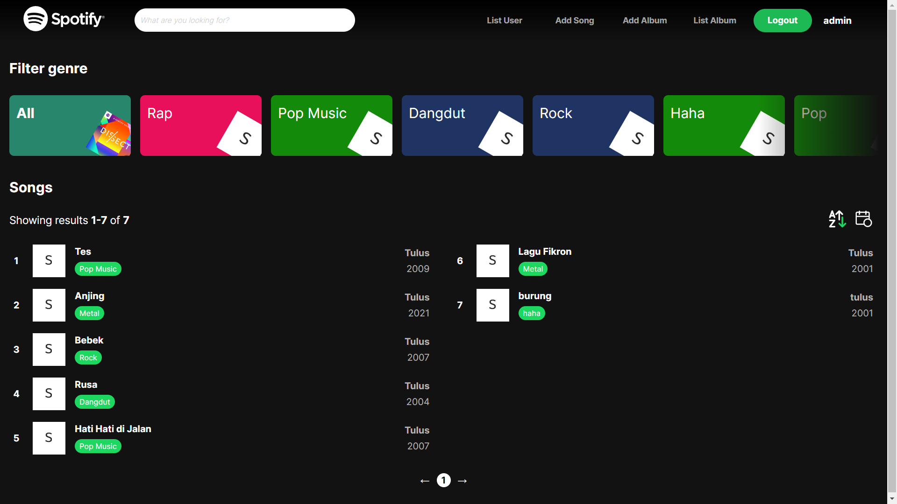

6. Halaman Detail Lagu
   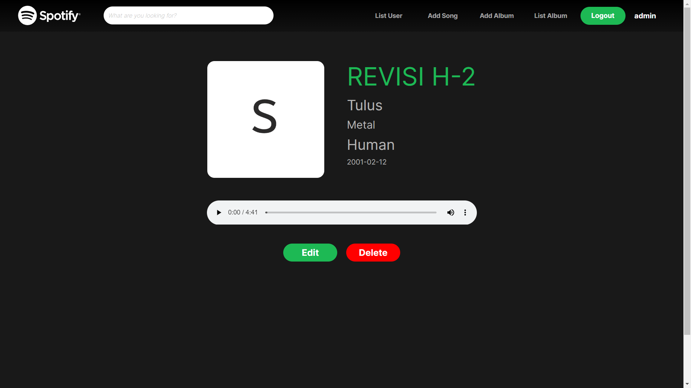

7. Halaman Detail Lagu Guest User Terkena Limit
   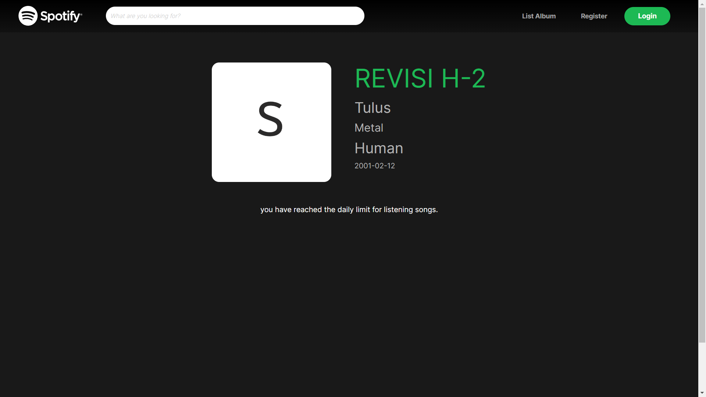

8. Halaman Edit Lagu  
   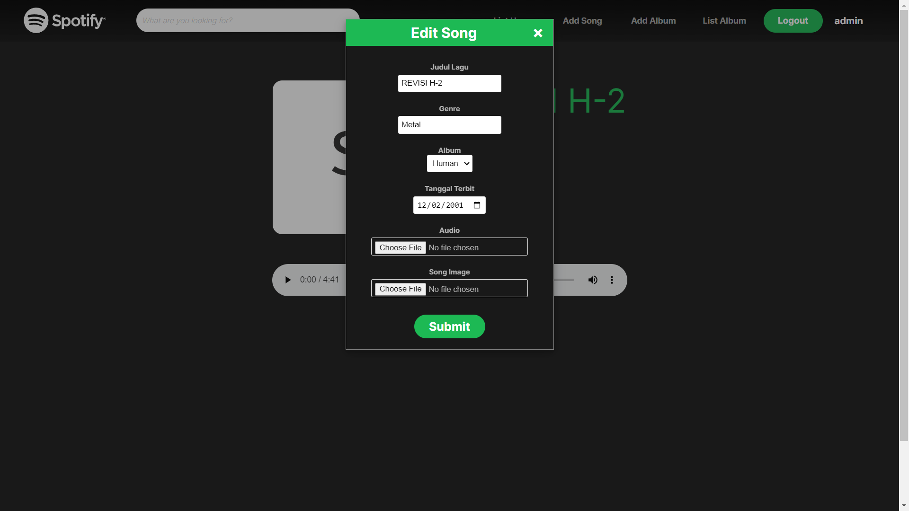

9. Halaman Detail Album  
   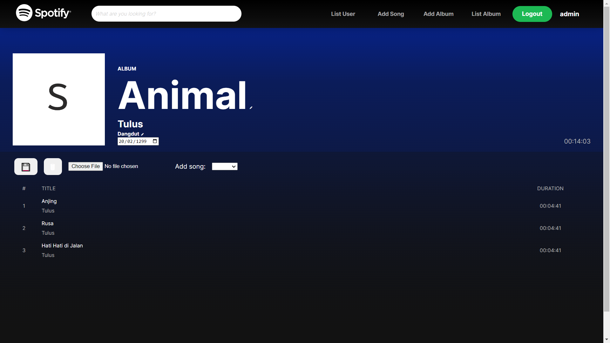

10. Halaman Tambah Lagu  
    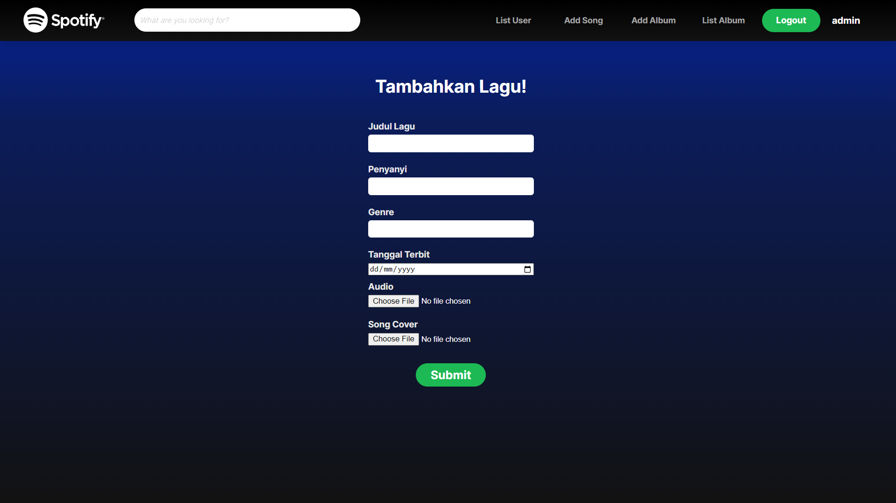

11. Halaman Tambah Lagu  
    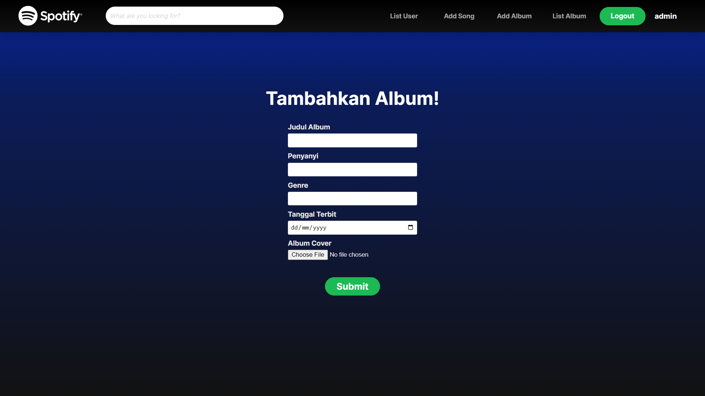

12. Halaman Daftar User  
    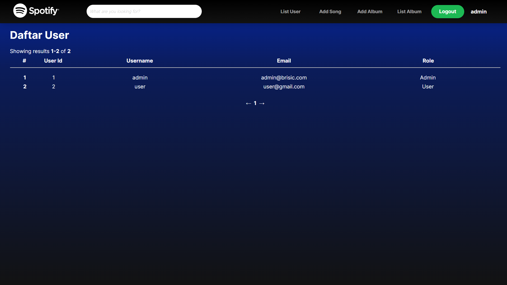

13. Halaman 404  
    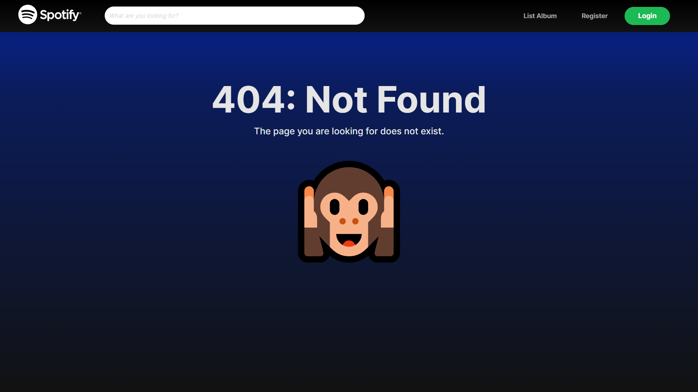

## Pembagian Tugas

### Server-side

1. Login : 13520056
2. Register : 13520056
3. Home : 13520059
4. Daftar Album : 13520113
5. Search, Sort, dan Filter : 13520113
6. Detail Lagu : 13520059
7. Detail Album : 13520113
8. Tambah Album : 13520059
9. Tambah Lagu : 13520059
10. Daftar User : 13520056

### Client-side

1. Login &nbsp; : 13520056
2. Register : 13520056
3. Home : 13520056, 13520113
4. Daftar Album : 13520113
5. Search, Sort, dan Filter : 13520113
6. Detail Lagu : 13520059, 13520056
7. Detail Album : 13520113
8. Tambah Album : 13520059, 13520056
9. Tambah Lagu : 13520059, 13520056
10. Daftar User : 13520056
11. Halaman 404 : 13520056
12. Navbar : 13520056

### Note

- Akun Admin :
  - Username : admin
  - Password : admin
